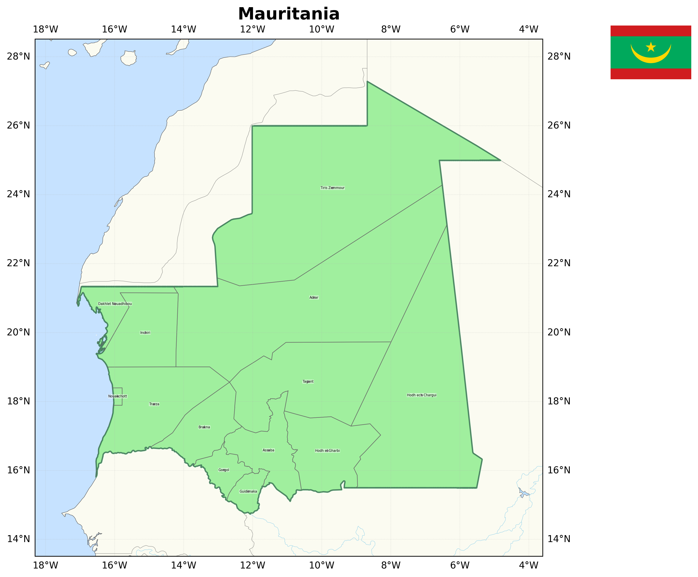

# Draw Country Map



Generate high-resolution maps of any country with its administrative divisions (wilayas, states, regions, départements, provinces) and national flag.

## Features

- **Accurate borders** — uses Natural Earth 10m resolution data
- **Administrative divisions** — shows and labels subnational regions with their names
- **Smart labels** — filters regions by size and uses `adjustText` to avoid overlapping labels
- **Country info panel** — displays area, population, GDP, continent on the map
- **National flag** — fetches and displays the country's flag on the map
- **Adaptive projection** — uses Robinson projection for wide countries (Russia, Canada, etc.) to avoid distortion
- **High resolution** — outputs 300 DPI PNG images
- **Full geographic context** — includes oceans, lakes, rivers, coastline, and gridlines
- **Cross-platform** — runs on Linux, macOS, and Windows (Python ≥ 3.8)

## Quick Start

```bash
python3 -m venv venv
source venv/bin/activate
pip install -r requirements.txt
python3 draw_map.py France
```

## Usage

```bash
python3 draw_map.py "<country name>"
```

Examples:

```bash
python3 draw_map.py Egypt
python3 draw_map.py "South Korea"
python3 draw_map.py Brazil
python3 draw_map.py Japan
python3 draw_map.py Mauritania
```

The map is saved as `{country}_map.png` (e.g. `egypt_map.png`). Flags are cached in `.flag_cache/` to avoid repeated downloads.

## Dependencies

- Python ≥ 3.8
- [cartopy](https://scitools.org.uk/cartopy/) — geographic data and map projections
- [matplotlib](https://matplotlib.org/) — rendering and plotting
